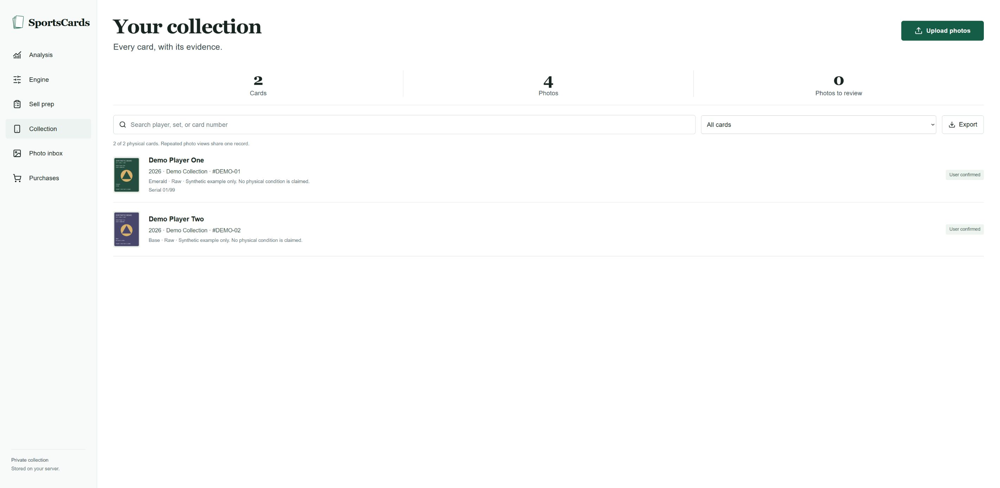
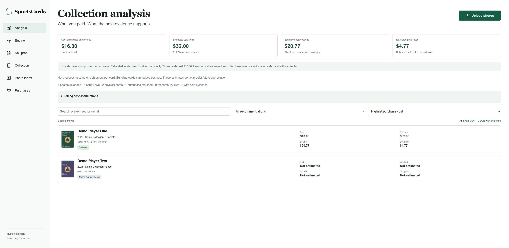
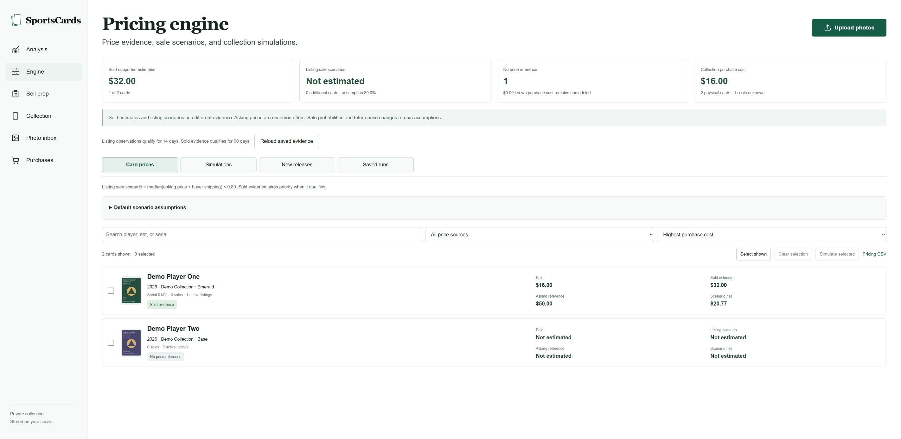
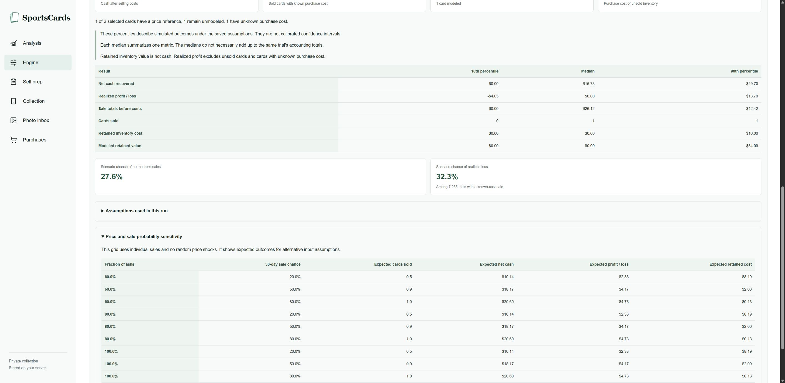
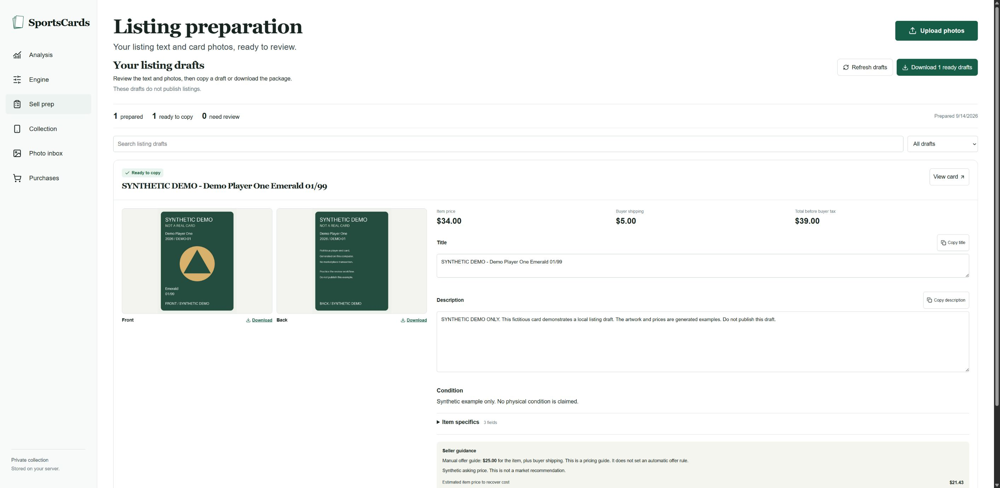

# Try a synthetic collection

This walkthrough uses two fictional cards and four generated images.
Every card image says **SYNTHETIC DEMO**.
The prices, purchases, evidence, condition statements, and listing terms are test data.
They are not market research or real sale offers.

The generator completes the local workflow so you can inspect each result in the dashboard.
It makes no network requests and does not publish marketplace listings.

## Create the example

1. Complete [installation](INSTALL.md).
2. Choose a new directory outside this repository and your real collection.
3. Run the generator with the project Python interpreter.

   Windows:

   ```powershell
   .venv\Scripts\python.exe scripts/demo.py --destination "$env:USERPROFILE/sportscards-demo"
   ```

   macOS or Linux:

   ```sh
   .venv/bin/python scripts/demo.py --destination "$HOME/sportscards-demo"
   ```

4. Start the dashboard with the command printed by the generator.
5. Open the printed local URL.

The destination must not exist. A repeated command must not overwrite a collection.
Use another new directory when you want a fresh example.
The generated JSON summary identifies the cards and saved results for this run.

If you connect Codex to this example, set the MCP data directory to the same demo path.
Use `python scripts/setup.py --skip-install --data-dir /path/to/your-demo` with the actual demo path.
Read [custom data configuration](INSTALL.md#check-or-repair) for details.
Confirm the two fictional card names before requesting any mutation.

### Return to your own collection

The MCP data selection persists after the demo server stops.

1. Stop the demo dashboard with `Ctrl+C` in its terminal.
2. Run `python scripts/setup.py --skip-install --data-dir /path/to/your-real-collection` with your actual collection path.
3. Start the dashboard with the matching command that setup prints.
4. Start a new Codex conversation to load the changed MCP configuration.
5. Check the collection path and card names before changing records.

For the default storage, supply the full path to `.sportscards` in your home directory.
Changing the selected directory does not move or merge collection data.

## Review the photos and physical cards

Open **Photo inbox** to inspect the four generated images.
Open **Collection** to inspect the two physical card records.
Each card has one front observation and one back observation.
All four parent photos have completed synthetic review.
The detector can add extra proposed observations. The generator marks those proposals ignored and confirms four full-card views.

| Card | Identity | Evidence |
| --- | --- | --- |
| Demo Player One | 2026 Demo Collection, DEMO-01, Emerald, 01/99 | Known synthetic purchase and price evidence |
| Demo Player Two | 2026 Demo Collection, DEMO-02, Base | Unknown purchase cost and price |



For real cards, upload your own photos and review the detections first.
Use `list_observations` to find observations.
Use `create_card` to create a physical card from a confirmed view.
Use `link_observation` to attach the matching back or a repeated view.
Keep separate physical copies in separate records.

## Match the purchase and inspect evidence

Open **Purchases** to inspect the synthetic purchase and its allocation.
Open **Analysis** to compare its cost with the saved sold evidence.

Expected values:

- Two physical cards and four reviewed photos.
- One purchase allocation of **$16.00** for Demo Player One.
- Three synthetic sold comparisons with a delivered-price median of **$32.00**.
- No allocated cost or supported value for Demo Player Two.



The second card must remain unknown. It must not become a zero-value card.
For real purchases, preserve the receipt and confirm the exact match before allocating its cost.
For real sold evidence, use `record_sold_comparable` only after reviewing the source and actual transaction price.
The example URLs and sale records in this walkthrough do not establish real transactions.

## Compare the pricing scenario

Open **Engine** and inspect Demo Player One.
The synthetic active listing has a **$50.00** delivered asking price.
The default 0.80 listing factor produces a **$40.00** asking-price scenario.
The engine uses the qualifying **$32.00 sold reference** for its model.

Open the saved simulation.
Its inputs use 10,000 trials, seed 42, a 90-day horizon, and individual sales.
Only Demo Player One has a modeled price.
Demo Player Two remains outside the modeled price total.





The percentiles describe the supplied scenario assumptions.
They do not validate future card prices or sale speed.
Use [pricing assumptions](PRICING_ENGINE.md) to interpret cash, retained inventory, and unknown values.

## Review and edit the listing draft

Open **Sell prep**.
The example contains one ready fixed-price draft for Demo Player One.
Its synthetic terms are **$34.00** for the item and **$5.00** for buyer shipping.
The draft includes its matching front and back images.



To edit through Codex:

1. Read the current card with `get_card`.
2. Read `selling_prep` to obtain the current manifest hash.
3. Review the proposed text, confirmed condition, selected photos, and terms.
4. Call `save_listing_draft` with the current card revision and manifest hash.
5. Refresh **Sell prep** and inspect the saved result.

The tool calculates the identity signature and crop hashes.
It rejects stale revisions, conflicting manifests, and invalid photo selections.
Changing a crop can invalidate a previously ready draft until review is repeated.

Download the ready package to inspect the listing text and images.
Keep this fictional package local. Do not publish it as a real card listing.
For your own cards, use the [browser or manual publication workflow](BROWSER_SETUP.md#manual-workflow).
Verify the actual marketplace result before recording a real listing as live.

## Validation

The generator tests check collection counts, linked photos, unknown values, price evidence, saved simulation, and the ready draft.
They also check that an existing destination cannot be overwritten.
Screenshots show the generated example in the local Chrome dashboard.
The demo validates local application behavior. It does not test a marketplace submission or every phone image format.
